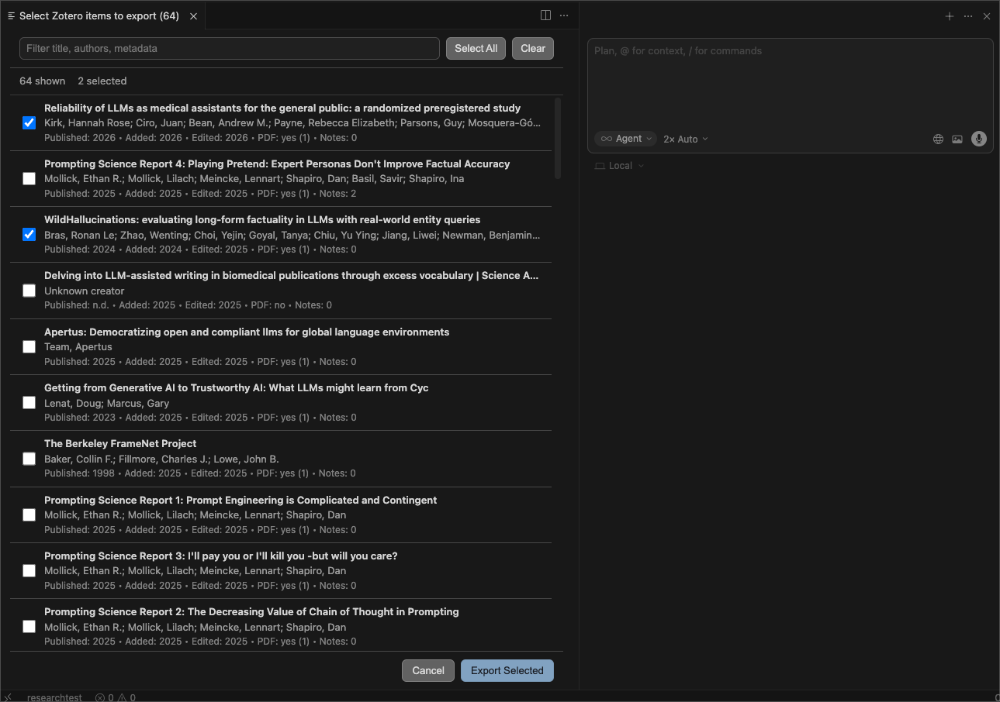
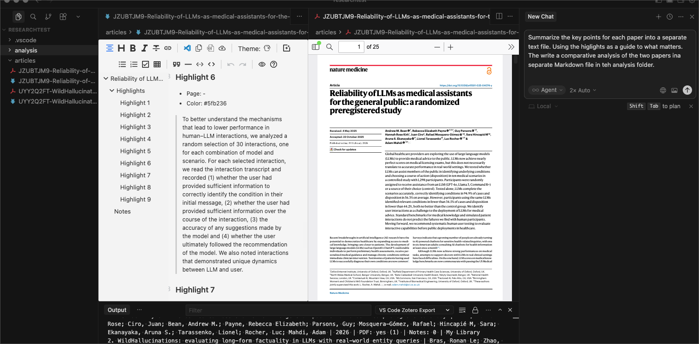
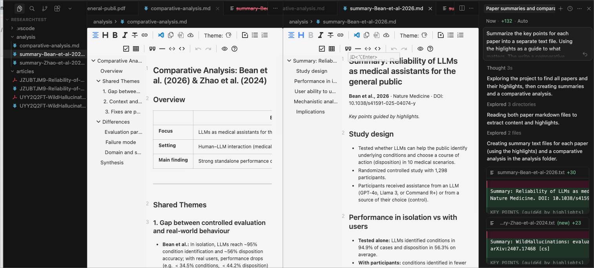

# Zotero Agent Bridge for VS Code/Cursor

Local-first Zotero export for VS Code-compatible editors, designed for AI-assisted academic writing workflows.

## What It Does

- Search your local Zotero library (My Library and group libraries).
- Export selected items or whole collections to Markdown + optional PDF files.
- Include Zotero metadata, highlights, and notes so agents can work directly from your own sources.
- Work offline against your local `zotero.sqlite` and `storage` folders.

## Screenshots

### Three-line picker (title, authors, metadata)



### PDF + highlights workflow in-editor



### Multi-file analysis workflow with agent panel



## Commands

- `Zotero: Search And Export Items`
- `Zotero: Export Collection`
- `Zotero: Configure Local Paths`

## Keyboard Shortcut

- Default shortcut for quick launch:
  - macOS: `Cmd+Alt+Z`
  - Windows/Linux: `Ctrl+Alt+Z`
- This runs `Zotero: Search And Export Items`.
- You can rebind it in Keyboard Shortcuts by searching for `vscodezotero.searchAndExport`.

## Search and Selection UX

When you run `Zotero: Search And Export Items`, each row in the picker shows:

- Line 1: title
- Line 2: authors
- Line 3: publication year, added year, edited year, PDF availability, note count

Picker actions:

- Filter by title/authors/metadata
- Multi-select with checkboxes
- `Select All` and `Clear`
- `Export Selected` or `Cancel`

## Export Functionality (Detailed)

Per exported Zotero item:

- Markdown file with YAML frontmatter metadata
- `Highlights` section from PDF annotations
- `Notes` section from Zotero child notes
- PDF copy (if available and selected)

Even if no PDF exists, metadata/notes/highlights export still runs.

## Collection Export Modes

Collection exports create a collection-named folder inside your export root.

- `Single collection folder`: all selected collection items into one folder
- `Mirror sub-collections`: preserve nested collection structure as subfolders

## Path Setup and Options

Configure paths via command:

- Run `Zotero: Configure Local Paths`

Or set workspace settings directly:

- `vscodezotero.sqlitePath`  
  Absolute path to `zotero.sqlite`.  
  If empty, extension attempts auto-discovery.

- `vscodezotero.storagePath`  
  Absolute path to Zotero `storage` folder.  
  If empty, extension tries sibling `storage` next to resolved sqlite path.

- `vscodezotero.outputPath`  
  Absolute output folder for exports.  
  If empty, extension prompts and then saves the selected location.

- `vscodezotero.outputFolderName`  
  Default folder name under workspace root when output path is not set (`articles` by default).

- `vscodezotero.layoutMode`  
  Export layout:
  - `item-folder`: `articles/<slug>/item.md` + PDFs in same folder
  - `flat`: `articles/<slug>.md` + prefixed PDFs
  - `year-item`: `articles/<year>/<slug>/item.md` + PDFs in same folder
  If empty, extension prompts once and saves your choice.

- `vscodezotero.maxSearchResults`  
  Max results shown in picker (default `200`, min `20`, max `1000`).

## Typical Agent Workflows

After export, ask your agent to:

- Summarize key findings across exported papers.
- Compare methods/results across selected studies.
- Draft a literature review section grounded in highlights/notes.
- Extract variables (sample size, model, outcomes) into structured tables.

## Privacy

- Uses local Zotero DB and local attachment files only.
- No Zotero Web API credentials required.
- No write-back/sync into Zotero in this version.

## Development

```bash
npm install
npm run compile
npm test
```

Run in VS Code extension host:

- Open this project in VS Code
- Press `F5`
